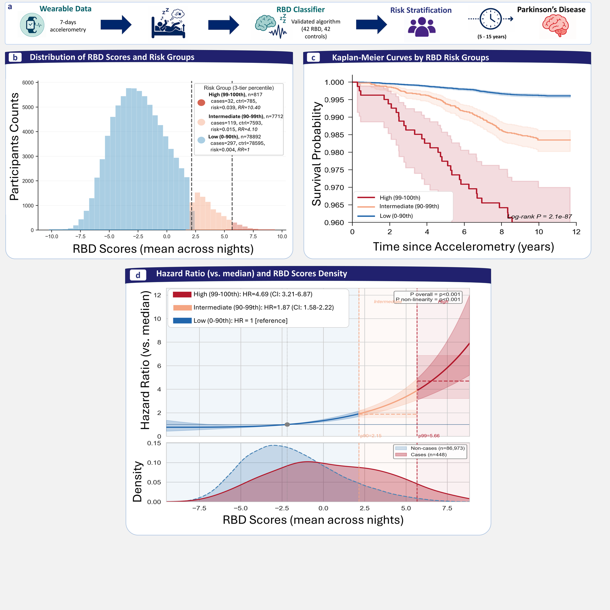

# UkbbRbdSleepPD

Analysis code for the study of **REM Sleep Behaviour Disorder (RBD) probability and prodromal
markers as predictors of Parkinson's disease (PD) and related neurodegenerative outcomes** in the
**UK Biobank (UKBB)**.

Per-night RBD scores are derived by a machine-learning model applied to raw
wrist-actigraphy recordings; this repository takes those scores as input, averages them per
subject, builds the analysis dataset from UKBB electronic-health-record (EHR) variables, derives
RBD risk groups, and runs the survival / risk-stratification / association analyses behind the
manuscript.

> **Data are not included.** UK Biobank data are controlled-access and cannot be redistributed.
> This repository is **code only**. See [Required inputs](#required-inputs) and [Data access](#data-access).



---

## Table of contents
- [What this code does](#what-this-code-does)
- [Repository layout](#repository-layout)
- [Installation](#installation)
- [Configuration](#configuration)
- [Required inputs](#required-inputs)
- [Running the analysis](#running-the-analysis)
- [Outputs](#outputs)
- [Data access](#data-access)
- [Citation](#citation)
- [License](#license)

---

## What this code does

The primary pipeline (`main.py`) runs the following stages in dependency order. Each stage is
toggled with a boolean flag at the top of `main.py`.

| Stage | Name | Description |
|------:|------|-------------|
| 1 | Build EHR dataset | Extract & process UKBB EHR variables from the raw data sheet into a tidy parquet. |
| 2 | Actigraphy collection | Collect & merge actigraphy-derived feature/score batches (gait, sleep, RBD). |
| 3 | Merge → risk groups | Merge EHR + RBD scores + gait, derive percentile-based RBD risk groups, write the analysis parquet. |
| 4 | Table 1 | Baseline characteristics table. |
| 5 | Cox prodromal analysis | Cox models M0–M4 (RBD × prodromal markers), splines, PH diagnostics, competing-risk, mediation. |
| 6 | Sleep phenotypes | Sleep-phenotype vs RBD-score evaluation. |
| 7 | Temporal validation | Temporal reliability of the RBD score. |

Additional **standalone analyses** (not driven by `main.py`) live in `pipelines/` — see
[Running the analysis](#running-the-analysis).

---

## Repository layout

```
.
├── main.py                  # Primary pipeline orchestrator (stage toggles)
├── environment.yml          # Conda environment (primary, fully pinned)
├── requirements.txt         # pip equivalent (Python 3.11)
├── config/                  # Paths config + reference bibliography
│   └── config.py            # Single source of truth for paths (see Configuration)
├── pipelines/               # Pipeline entry points (stages + standalone analyses)
├── library/                 # Analysis library
│   ├── cox_prodromal/       # Core Cox prodromal models, splines, PH diagnostics, competing risk
│   ├── cox_analysis/        # Survival-dataset construction utilities
│   ├── rbd_prodromal_mediation/  # Mediation analysis (RBD → prodromal → outcome)
│   ├── rbd_prs_association/  # RBD × polygenic-risk-score genetic association
│   ├── lr_analysis/         # Likelihood-ratio / prodromal LR analysis
│   ├── ml_cross_sectional/  # Cross-sectional ML models
│   ├── screening/           # Screening-model data loading
│   ├── risk/                # RBD risk-group thresholding & stratification
│   ├── ehr_outcomes/        # Outcome (PD/AD/dementia) definitions from EHR
│   ├── ehr_reader/          # UKBB EHR field reading/parsing
│   ├── abk_collection/      # Actigraphy batch collection / score assembly
│   ├── reporting/           # Table & report formatting
│   └── parser/              # Field/column parsing utilities
├── generators/              # Manuscript figure & formal-table generators
├── analysis/                # Sleep-phenotype analyses (stages 6–7)
├── notebook/                # Supplementary analysis scripts (prodromal/cognitive deltas, etc.)
└── utils/                   # Auxiliary helper scripts
```

---

## Installation

Requires **Python 3.11**.

### Conda (recommended)

```bash
conda env create -f environment.yml
conda activate stats_env
```

### pip / venv

```bash
python -m venv .venv
source .venv/bin/activate        # Windows (PowerShell): .venv\Scripts\Activate.ps1
pip install -r requirements.txt
```

> `lifelines==0.30.0` and `numpy<2.0` are pinned deliberately (survival API / ABI compatibility).

---

## Configuration

All paths are resolved in **`config/config.py`** relative to the repository root, except the
location of the controlled-access UKBB data sheet, which you provide via an environment variable:

```bash
# Linux / macOS
export UKBB_DATA_ROOT=/path/to/your/ukbb_datasheet

# Windows (PowerShell)
$env:UKBB_DATA_ROOT="C:\path\to\your\ukbb_datasheet"
```

If `UKBB_DATA_ROOT` is unset, the code falls back to `./data/ukb_datasheet`. Place all other
required inputs under `./data/` following the structure referenced in `config/config.py`
(e.g. `data/pp/...`, `data/actig_extracted_features/merged/...`, `data/pp/genetics/...`).

---

## Required inputs

None of these are shipped (controlled access). You must supply them under `./data/`:

| Input | Used by | Notes |
|-------|---------|-------|
| UKBB EHR data sheet + data dictionary | Stage 1 (build) | Raw UKBB field extract; location set via `UKBB_DATA_ROOT`. |
| UKBB withdrawal list | Stage 1 | `withdraw_subjects_ukb_*.csv` — subjects to exclude. |
| RBD probability scores (per night) | Stage 3 (merge) | Parquet with `irbd_sleep_score`; produced upstream by the actigraphy ML model. |
| Gait features | Stage 3 | Actigraphy-derived gait parquet. |
| Polygenic risk scores (PRS) + GBA | PRS association | TSV files under `data/pp/genetics/`. |

---

## Running the analysis

### Primary pipeline

Edit the stage toggles at the top of `main.py` (set the stages you want to `True`), then:

```bash
python main.py
```

```python
# main.py — stage toggles
RUN_BUILD_EHR        = True    # Stage 1
RUN_ABK_COLLECTION   = False   # Stage 2
RUN_MERGE            = False   # Stage 3
RUN_TABLE_ONE        = False   # Stage 4
RUN_COX_PIPELINE     = False   # Stage 5
RUN_SLEEP_PHENOTYPES = False   # Stage 6
RUN_SLEEP_TEMPORAL   = False   # Stage 7
```

### Standalone analyses

Run directly with the Python interpreter (script-based, no CLI arguments):

```bash
python pipelines/run_cox_pipeline.py            # Cox prodromal analysis (direct entry)
python pipelines/run_table_one.py               # Table 1
python pipelines/run_rbd_prs_association.py     # RBD × PRS genetic association
python pipelines/multi_night_sensitivity.py     # Actigraphy night-count sensitivity
python pipelines/run_ml_cross_sectional.py      # Cross-sectional ML models
python pipelines/main_screening.py              # Screening-model comparison
```

Manuscript figures and formal tables are produced by the scripts in `generators/`.

---

## Outputs

Results, logs and figures are written under `./results/` and `./logs/` (both git-ignored).
Tables are written as `.xlsx`; figures as image files. These directories are created on first run.

---

## Data access

UK Biobank data are available to approved researchers via the
[UK Biobank Access Management System](https://www.ukbiobank.ac.uk/enable-your-research/apply-for-access).
This analysis was conducted under an approved UK Biobank application. Data cannot be redistributed;
approved users must obtain the underlying data directly from UK Biobank.

---

## Citation

A manuscript describing this work is in preparation. Please cite the software via `CITATION.cff`
(GitHub: *Cite this repository*). The manuscript citation (title, authors, journal, DOI) will be
added here on acceptance.

---

## License

[MIT](LICENSE) © 2026 Giorgio Camillo Ricciardiello Mejia
